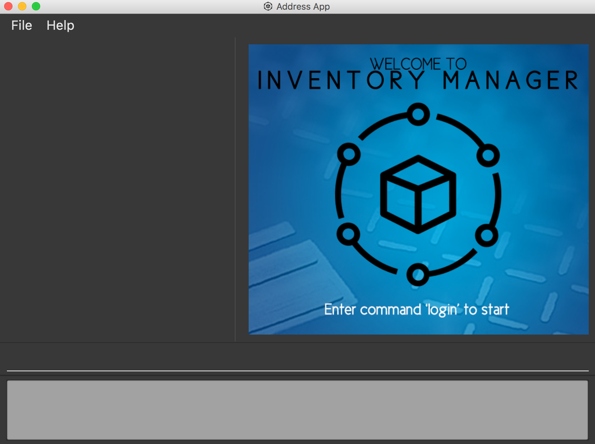

= Inventory Manager
ifdef::env-github,env-browser[:relfileprefix: docs/]

https://travis-ci.org/CS2103-AY1819S1-W14-4/main[image:https://travis-ci.org/CS2103-AY1819S1-W14-4/main.svg?branch=master[Build Status]]
https://ci.appveyor.com/project/darren96/main-cr0gn[image:https://ci.appveyor.com/api/projects/status/tgdvtfq36hlrg559?svg=true[Build status]]
https://coveralls.io/github/CS2103-AY1819S1-W14-4/main?branch=master[image:https://coveralls.io/repos/github/CS2103-AY1819S1-W14-4/main/badge.svg?branch=master[Coverage Status]]
https://app.codacy.com/project/darren96/main[image:https://api.codacy.com/project/badge/Grade/3521652dc4b64ae6b16ec2d3c493df9c[Code Quality]]

ifdef::env-github[]

endif::[]

ifndef::env-github[]
image::images/Ui.png[width="600", align = "center"]
endif::[]

* This is a desktop Inventory Management application. It has a GUI but most of the user interactions happen using a CLI (Command Line Interface).
* It is a Java application which aims to help supermarkets' stakeholders to manage the inventory.
* It is *written in OOP fashion*. This will enable the application to model the supermarket realistically and help stakeholders to manage the inventory smoothly.

== Site Map

* <<UserGuide#, User Guide>>
* <<DeveloperGuide#, Developer Guide>>
* <<AboutUs#, About Us>>
* <<ContactUs#, Contact Us>>

== Acknowledgements

* This application originated from AddressBook-Level4 project, created by SE-EDU initiative at https://github.com/se-edu/.
* Some parts of this sample application were inspired by the excellent http://code.makery.ch/library/javafx-8-tutorial/[Java FX tutorial] by
_Marco Jakob_.
* Libraries used: https://github.com/TestFX/TestFX[TextFX], https://bitbucket.org/controlsfx/controlsfx/[ControlsFX], https://github.com/FasterXML/jackson[Jackson], https://github.com/google/guava[Guava], https://github.com/junit-team/junit5[JUnit5]

== Licence : link:LICENSE[MIT]
